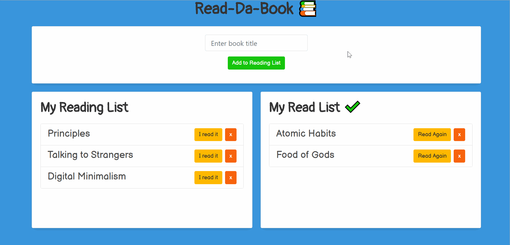

# Reading List

 

### URL: https://darnocer.github.io/Node-Express-Handlebars-Reading-List/

## Description

An application to manage your book reading list utilizing Node and Express, MySQL database, and rendered with Handlebars.

## Table of Contents

- [Installation](#installation)
- [Usage](#usage)
- [Future Enhancements](#future-enhancements)
- [Credits](#Credits)
- [Questions](#questions)

## Installation

```
fork repo
clone repo to local machine
update the password for the MySQL connection in connection.js
npm install express express-handlebars mysql
node server.js
navigate to localhost:8080
```

## Usage

- Enter any book title you'd like to read in the input field and click "Add to Reading List" to put it on your Reading List.
- Click "I read it" to move the book to your "My Read List".
- Click "Read Again" to add the book back to your Reading List
- You can delete any book at any time from either list using the delete ('x') button.
  

## Future Enhancements

- add scrolling to list containers to keep the size consistent
- pull and display book authors automatically from the title via API

## Credits

- [Bootstrap](https://getbootstrap.com/)

- [bulma.io](https://bulma.io)

- [jQuery](https://api.jquery.com/)

- [Font Awesome](https://fontawesome.com/)

- [Handlebars](https://www.npmjs.com/package/handlebars)

- [MySQL](https://www.npmjs.com/package/mysql)

- [Express.js](https://www.npmjs.com/package/express)

## Questions?

Contact me at [darian.nocera26@gmail.com](mailto:darian.nocera26@gmail.com)

or [](http://www.github.com/darnocer)

Copyright © 2020 [Darian Nocera](http://www.github.com/darnocer)

---

##### _Created with [darnocer's README generator](https://github.com/darnocer/Node.js-and-ES6-README-Generator)_ 👽
